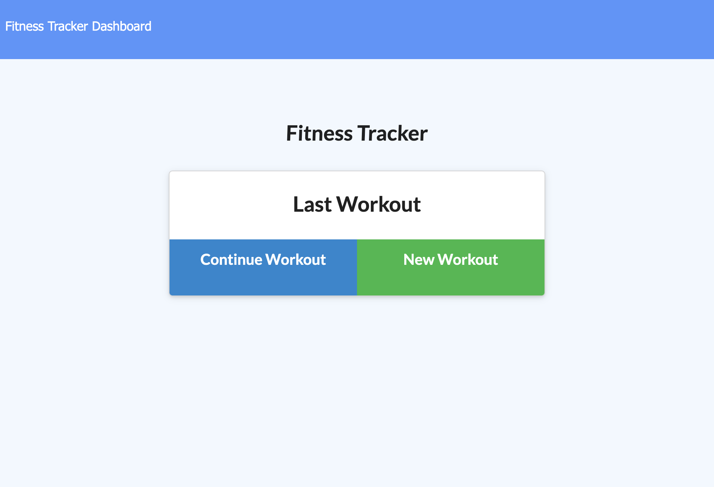
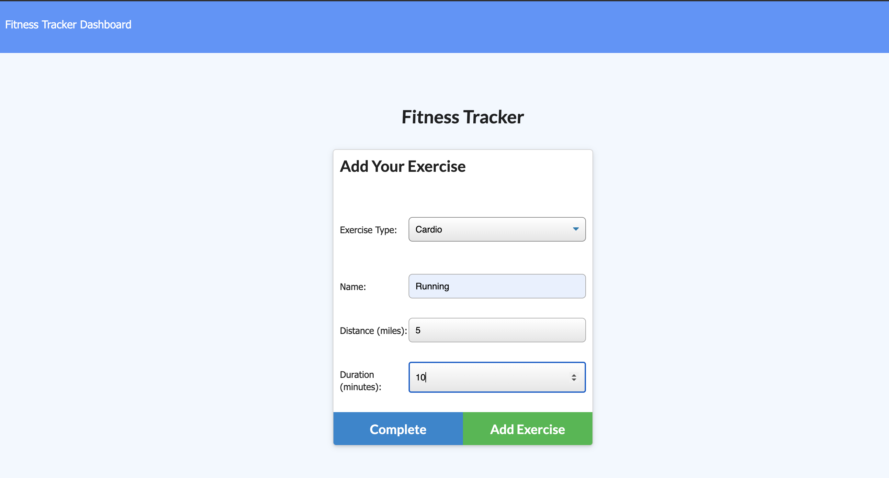
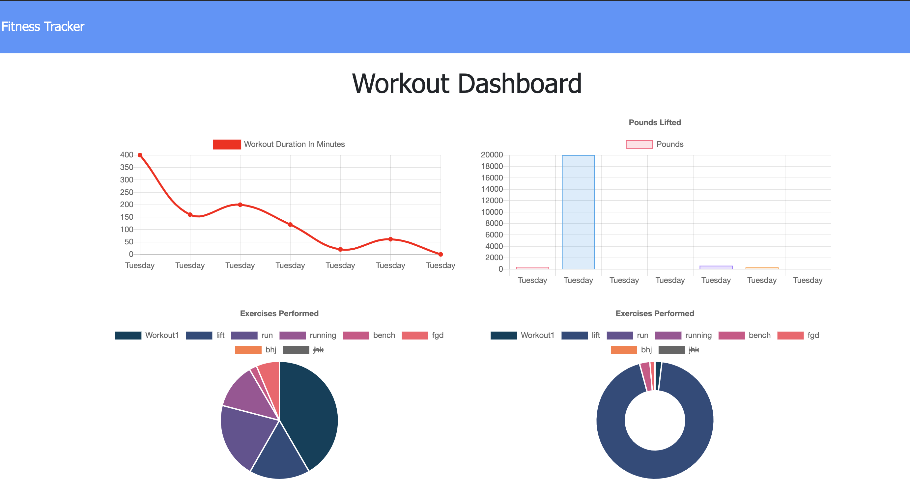

# Workout Tracker

## Description
This application allows you to input a workouts.  With the proper input, you are able to track the weight, and duration of the exercise for weight excerises over the past 7 workouts. If the exercise is a cardio exercise, you are only able to track my duration.  These results can be displayed on the dashboard with charts able showing which workouts contributed the most/least.  This also allows you to remove workouts to see only certain ones. 

## Table of Content

* [Heroku](#Heroku)

* [Photos](#photos)

* [Installation](#installation)

* [Technology](#Technology)

* [Contribution](#contribution)

* [Questions](#questions)

## Heroku

<a href="https://workouttracker-kate.herokuapp.com/">Heroku Link</a>

## Photos
Running the application


Adding a workout


Looking at stats page


## Technology

Technologies used: MongoDB, Mongoose, Express.js, JavaScript, HTML, CSS, and Heroku.

## Installation
To install necessary dependencies, run the following command:

```bash
npm i
```

## Contribution

Thanks to the instructors and teaching assistants at UNC Chapel Hill Bootcamp for making the creation of this webpage possible.

## Questions

If you have any questins about the repo, you can contact me directly at catherine.ann.milano@gmail.com. You can find more of my work at [katemilano](http://github.com/katemilano/).
    

